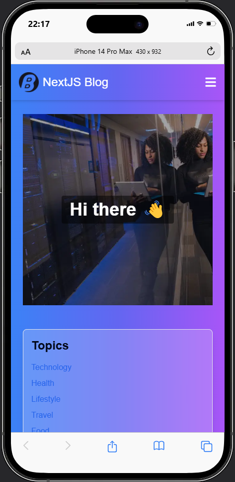

# Next.js Blog

Welcome to the Next.js Blog project. This application showcases a modern blog platform built with the latest features of Next.js 14, TypeScript, and Redux. The blog includes functionalities such as viewing recent posts, searching for posts, viewing post details with comments, and bookmarking posts.

## Screenshots

| Homepage (Desktop)                              | Homepage (iPad)                              | Homepage (Phone)                              |
| ----------------------------------------------- | -------------------------------------------- | --------------------------------------------- |
|  |  |  |

## Project Details

### Technologies Used

- **Next.js 14**: Utilized the new App Router for server components and improved data fetching.
- **TypeScript**: Ensured type safety throughout the application.
- **Redux**: Managed application state for posts and bookmarks.

### Pages Implemented

- **Home Page**
  - Displays recent posts with a visually appealing gradient background.
  - Features a header image with a welcoming title.
- **Posts Page**

  - Allows searching for posts by title.
  - Lists all posts with an interactive search functionality.

- **Post Details Page**

  - Shows the details of a selected post.
  - Displays comments associated with the post.

- **Bookmarked Posts Page**
  - Lists all posts that the user has bookmarked.
  - Displays a message and call-to-action if no posts are bookmarked.

### Features

- **Responsive Design**

  - The application is fully responsive, with layouts optimized for desktop, tablet, and mobile devices.

- **Bookmarks**

  - Users can bookmark their favorite posts, which are saved in the Redux store.
  - The BookmarkIcon component allows toggling bookmarks with visual feedback.

- **Navigation**
  - A responsive navigation bar that highlights the current route.
  - Includes links to the Home, All Posts, and a profile section.

### Installation and Setup

1. Clone the repository:

   ```bash
   git clone https://github.com/your-username/nextjs-blog.git

   ```

2. Navigate to the project directory:

   ```bash
   cd nextjs-blog
   ```

3. Install dependencies:

   ```bash
   npm install
   ```

4. Start the development server:

   ```bash
   npm run dev
   ```

5. Open your browser and visit `http://localhost:3000` to see the application in action.

### Future Enhancements

- Add user authentication.
- Implement pagination for posts.
- Enhance the UI with more animations and interactive elements.

## Contributions

Contributions are welcome! Please open an issue or submit a pull request if you have any improvements or bug fixes.

## License

This project is licensed under the MIT License.

## Contact

Developed by Latif Essam.

- **Email**: [latif_essam@outlook.com](mailto:latif_essam@outlook.com)
- **Portfolio**: [Latif's Portfolio](https://portfolio-latifessams-projects.vercel.app/)
- **LinkedIn**: [Latif Essam](https://linkedin.com/in/latifessam)
- **Facebook**: [Latif Essam](https://www.facebook.com/LatifEssam/)
